# Reflektion
## Kap. 2
Jag har tänkt mycket mer på att namngivningen ska vara tydlig och vikten av det. Jag har fortfarande tenderat att använda mig av "noise" ord som data/info så det är något jag kommer fortsätta tänka på att undvika. Jag har försökt vara tydlig och hålla namnen korta, vilket jag tycker att jag har med mig sen innan. Men det som var den största utmanningen var "pick one word per concept" och att hålla sig till det. Samt att hitta rätt ord för att beskriva exakt vad funktionen/variable/klassen gör/har i uppgift.

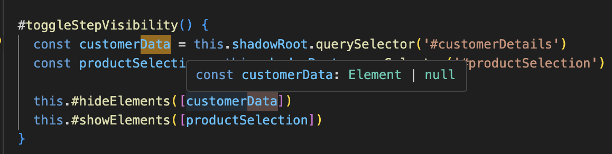

## Kap. 3
Att arbeta med Clean Code och funktioner har varit en stor utmaning. Jag har blivit väldigt medveten om min "vana" att skriva längre funktioner som ofta gör mer än en sak och har olika abstraktionsnivåer. Jag har valt att att bryta ut validering till separata funktioner. Jag har inte följt "command query separation" så bra för att jag kämpade lite med att bryta ut det och få ihop logiken när jag försökte med detta.

Jag har även brytit error-hantering i try/catch-satserna att hanteras av en separat funktion. 

Jag har även undvikit att ha nästlade loopar och funktioner. 

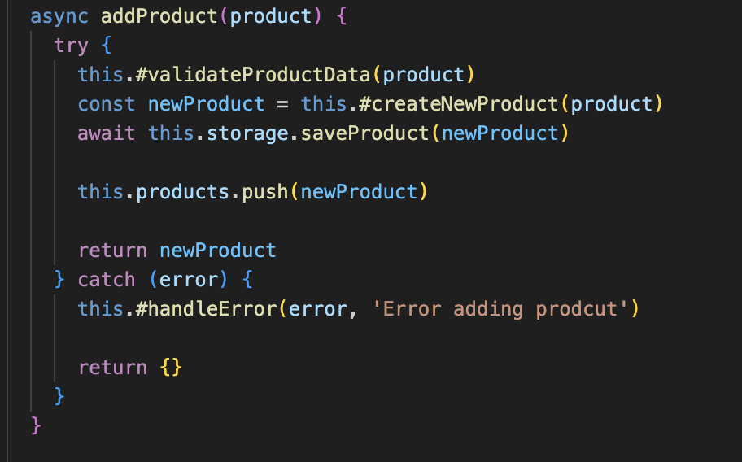
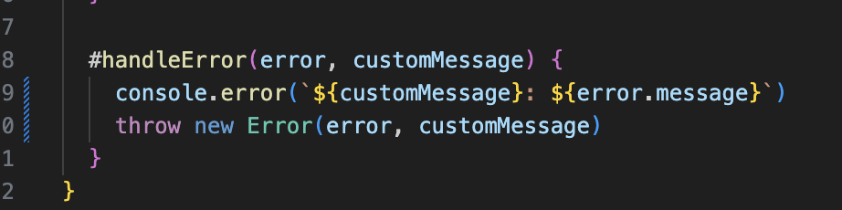
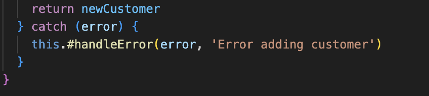

## Kap. 4
Jag har undvikit kommentarer i stort sätt helt då jag upplever att jag inte har en kod som är allt för komplex(som ex regulära uttryck osv). Då jag är van att använda kommentarer mycket så gjorde det att jag blev mer uppmärksam på namngivning och strukturering av koden när jag tog bort kommentarerna och lät koden få vara självförklarande. Då jag upplevde att kommentarerna jag hade innan, inte tillförde någon ny information valde jag att ta bort de. 

## Kap. 5
Jag har hållt mina rader korta. Jag har försökt att hålla mig till reglerna kring openness och density där jag använt white space kring () för att kunna avgöra vart parametern/argumentet tillhör. Och unvikit att ha white space efter funktionsnamn. 

Gällande indentations har valde jag att använda mig av npm standard för att få rätt visuella represenation av hierarkin i koden. Jag har kämpat lite med när och var det är lämpigt att ha tomma rader. Men jag satte en standard att alltid ha en tomrad efter return statements.

Att jag satte standard gjorde att läsbarheten ökar och skapar mer tydlighet i att det separerar element då varje fil har samma formattering. 

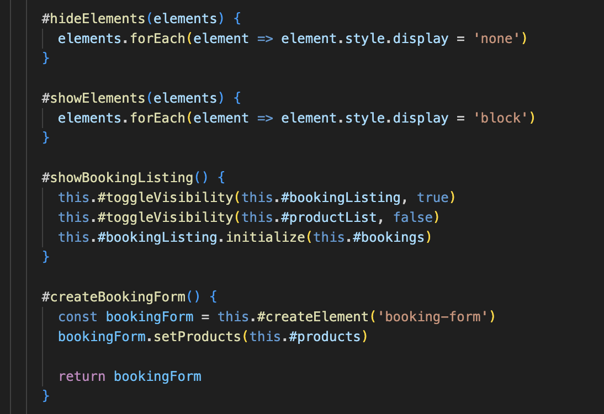

## Kap. 6
Jag har valt att kaplsa in ex. BookingManagers internal state. Metoderna addProduct(), loadData() till exempel, tillåter användaren att använda objektet utan att behöva veta vad sker internt. Jag skulle kunna få ännu mer inkapsling i det objektet genom att skapa separata metoder som hanterar de övriga klasserna. 

Om det skulle behövas läggas till andra beteenden så skulle klassen eventuellt behöva ha ännu mer inkapsling och ännu mer separation of concerns implementerat. 

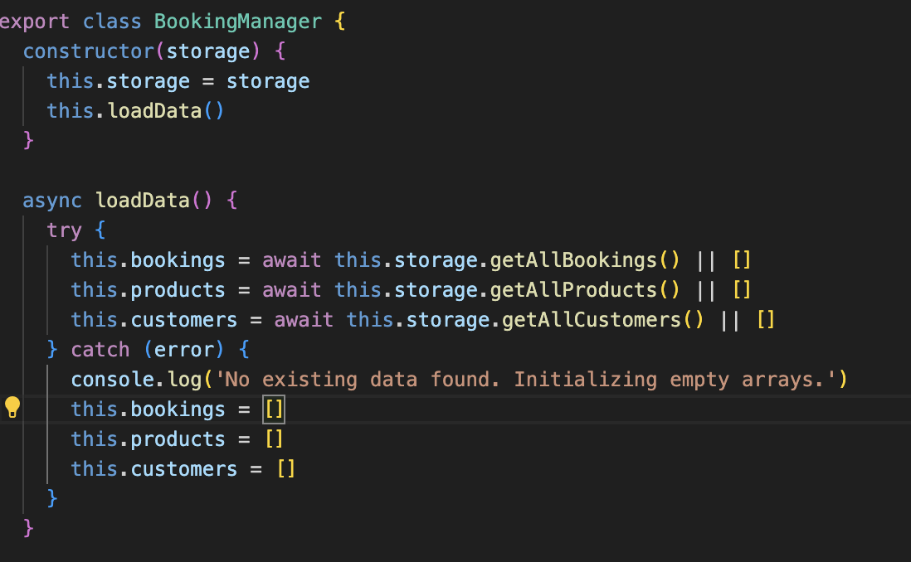
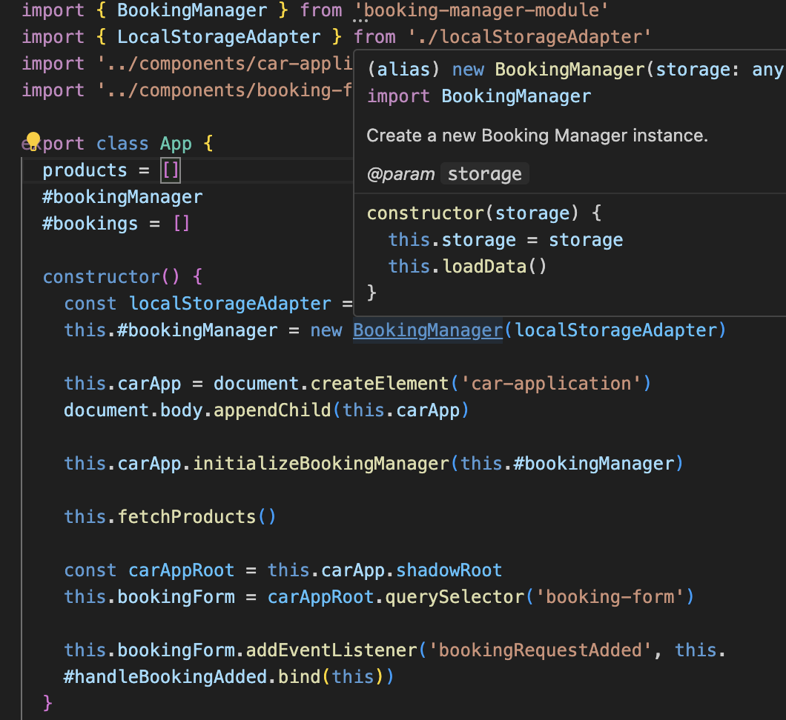

## Kap. 7
Jag använder mig av try-catch-satser för att fånga potentiella fel och undvikit att returnera null. Detta gör att felet loggas och programmet inte krashar. Däremot har jag inte implementerat någon final-sats eller "återhämtning" av felet vilket gör att statet kommer att påverkas i vissa fall. Och även om applikationen fortfarande körs så kan flödet eller funktionaliteten ha påverkats på ett sätt som gör att applikationen inte funkar som jag tänkt längre. 

Jag har specifika felmeddelanden som loggar när felet uppstår och ger kontext. På vissa ställen har jag med mer information (ex. vilket id som inte hittats). Men detta skulle jag kunna göra på fler eller alla ställen.

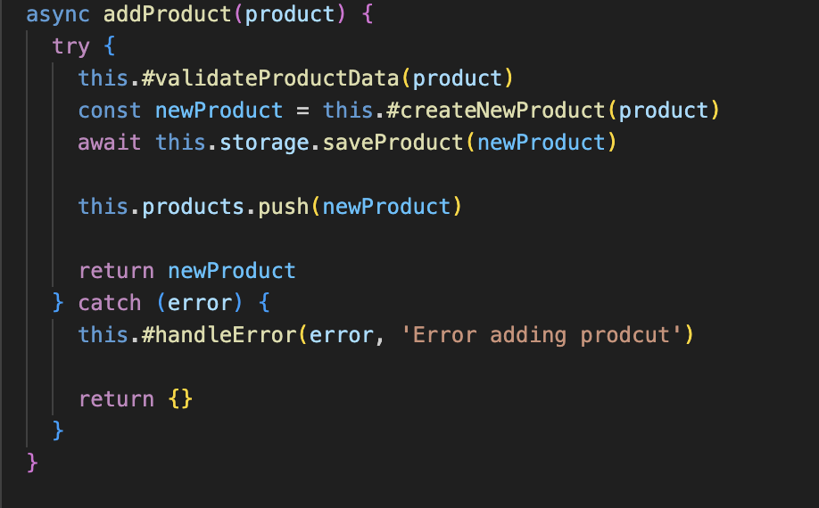
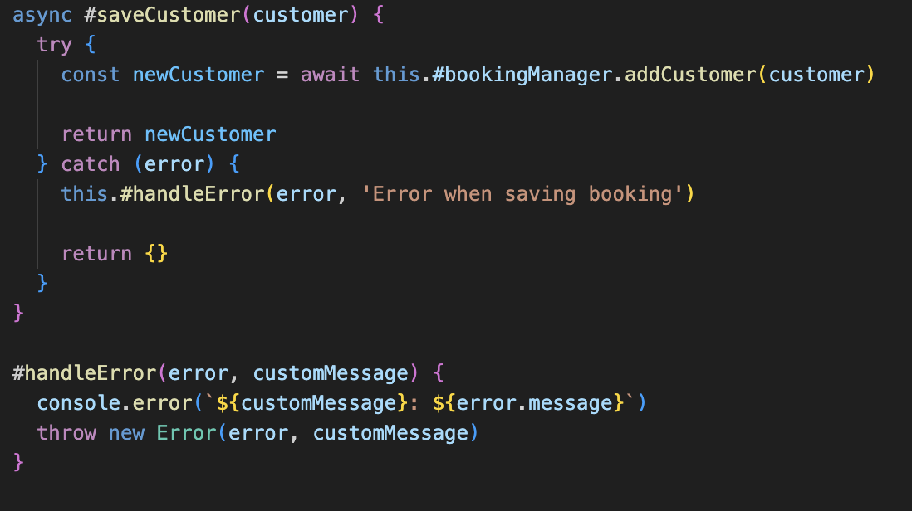

## Kap. 8
Jag har valt att kaplsa in third-party kod som jag importerar genom min localStorageAdapter istället för att direkt använda mig av ex. localStorage.

Jag skulle kunna implementera fler metoder för att kapsla in metoderna från BookingManager ännu mer och därmed gör framtida implementring enklare.

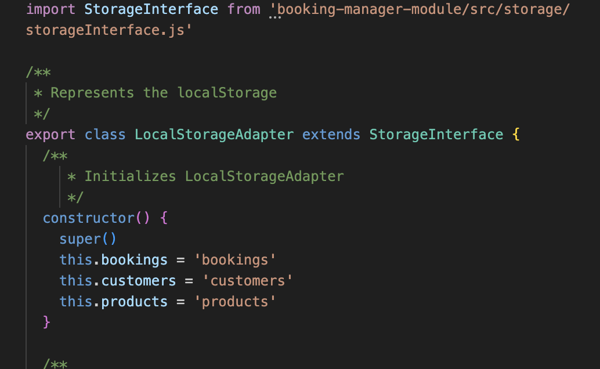
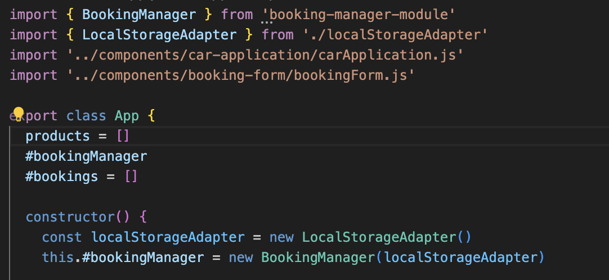

## Kap. 9
Jag valde mig att göra automatiska jest-tester till båda uppgifterna. Men i L3 har jag endast implementerat de manuella testerna, tanken är att ha Jest till server-sidan i framtiden. Testerna följer FIRST principerna då de är snabba, varje test är oberoende av de andra. Detta gjorde jag med jest.mocks för att kunna testa utan third party storage/bookingManager etc. Testerna är upprepningsbara och och self-validating då de presenterar ett fail/successful resultat för varje test.

Jag har dock inte lagt in testerna för än i slutet av utveckling, det finns ingen tanke med det utan är helt enkelt en miss. Däremot har jag utformat testerna utifrån min list av krav som jag gjorde innan jag påbörjade implementeringen. 

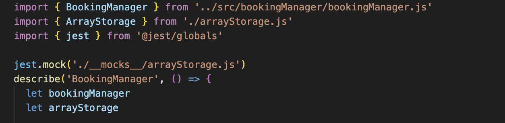
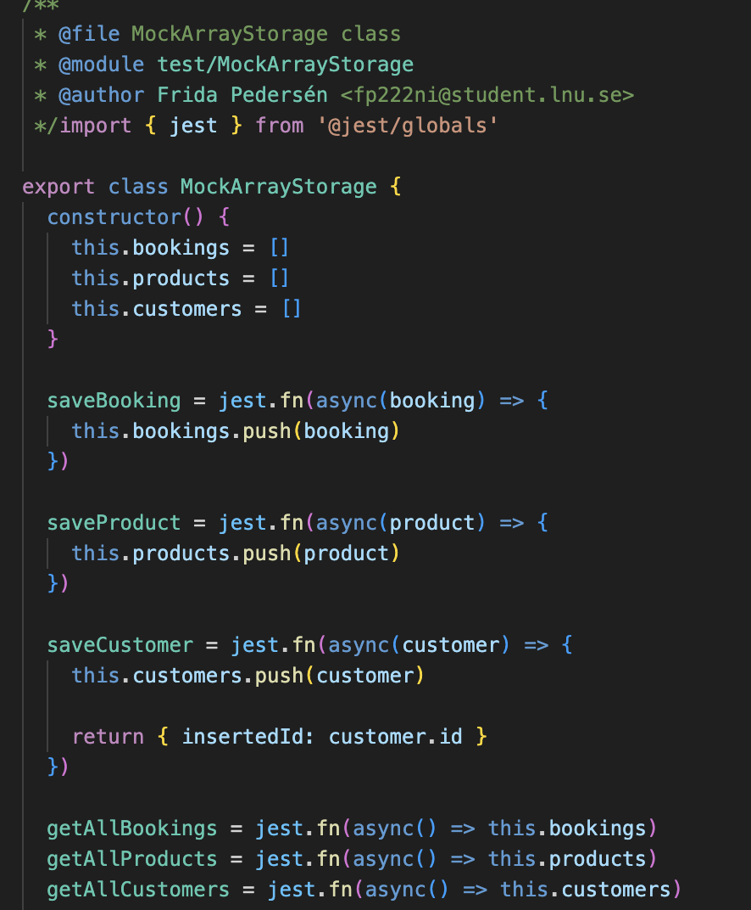

## Kap. 10
De flesta klasserna följer SRP och har en tydlig uppgift. Jag har försökt separera funktionalitet i privata funktioner för att undvika att ha för mycket funktionalitet i constructorn. 

Jag skulle absolut kunna ha fler klasser för att få ännu mer single responsibility. Kanske ha en separat manager för product, customer och booking. 

Gällande OCP så är klasserna isolerade för att inte kunna modifieras, däremot skulle jag kunna göra det ännu mer genom att ha fler klasser som "extendar" istället för att ha det i samma. Det skulle göra att kalsserna enkelt kan modifieras utan att förlängas.

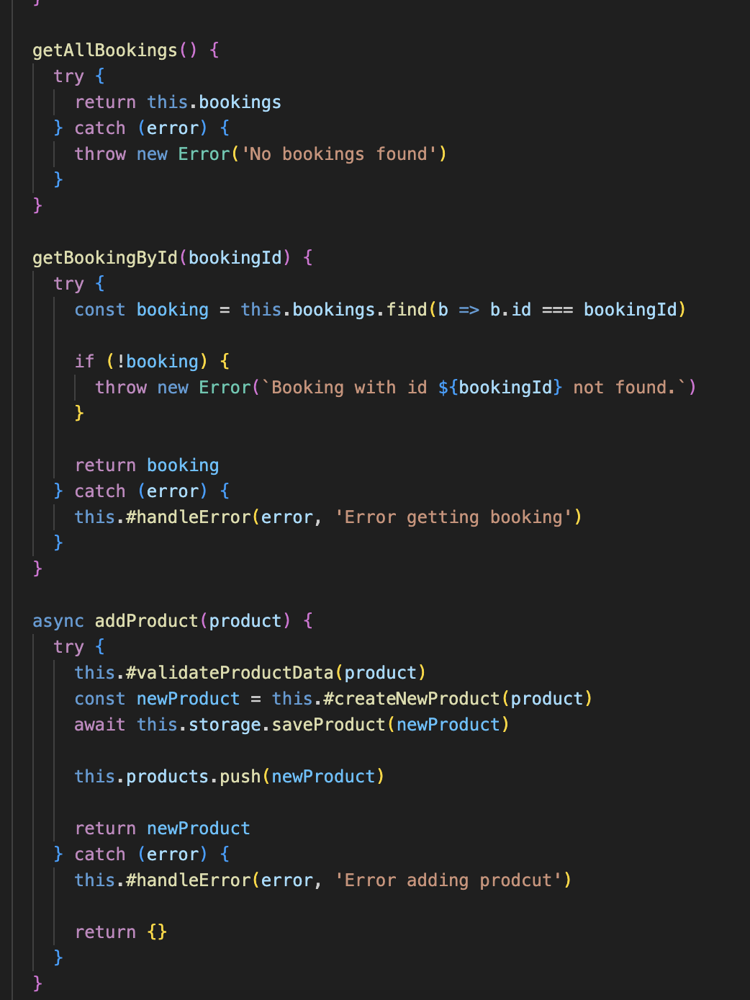

## Kap. 11
Jag har delat på logiken och interfacet genom att ha App.js som kontrollerar komponenterna och har BookingManager som tar hand om logiken. 

BookingManager har en non-invasive design eftersom den tar storage som argument vilket möjligör valbarhet i typ av lagring. 

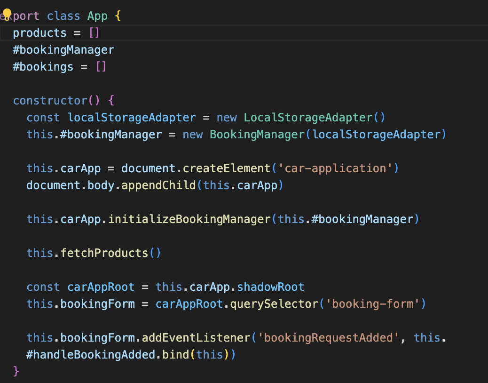
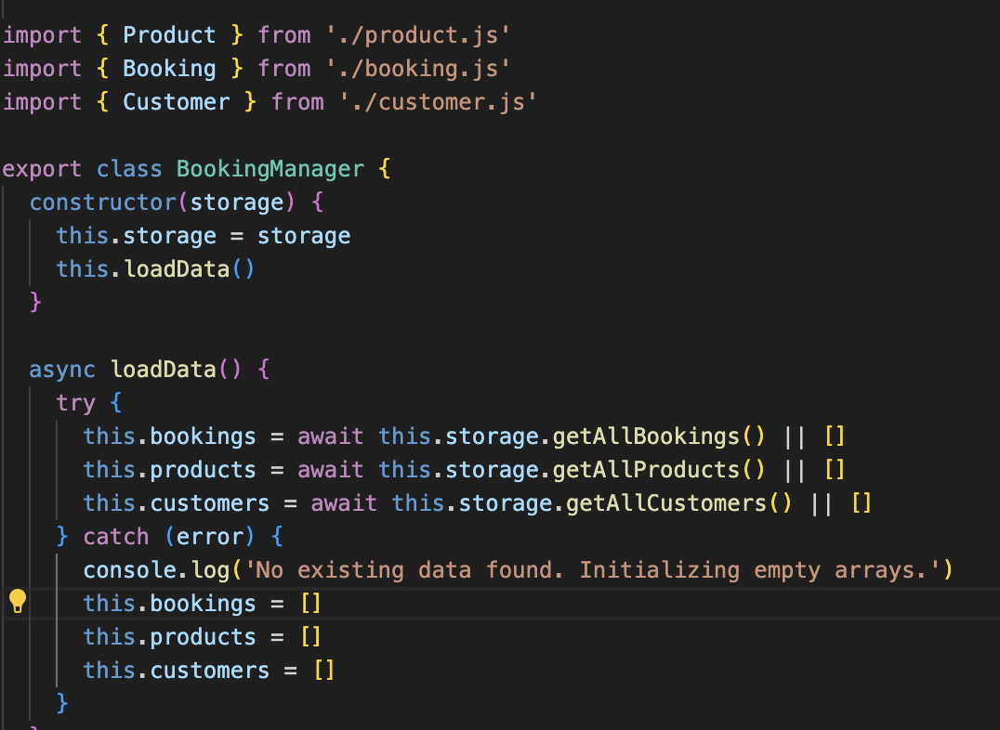

